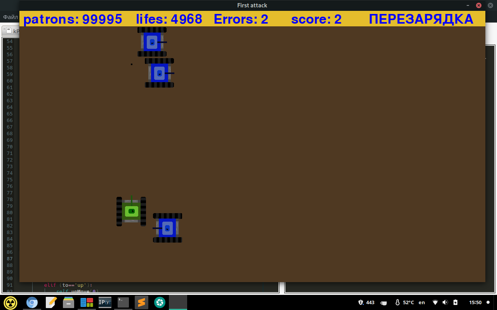
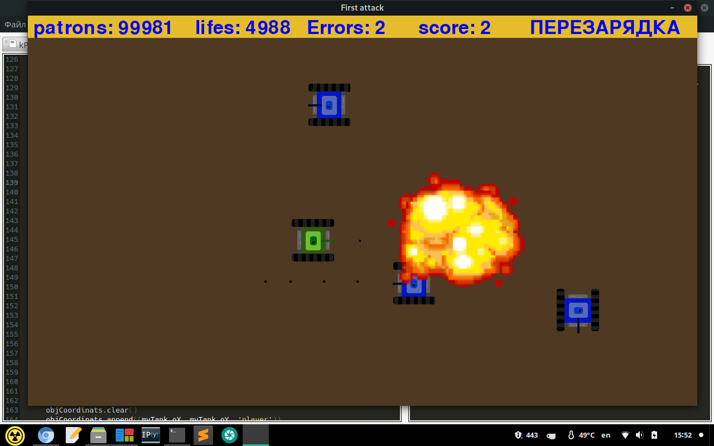
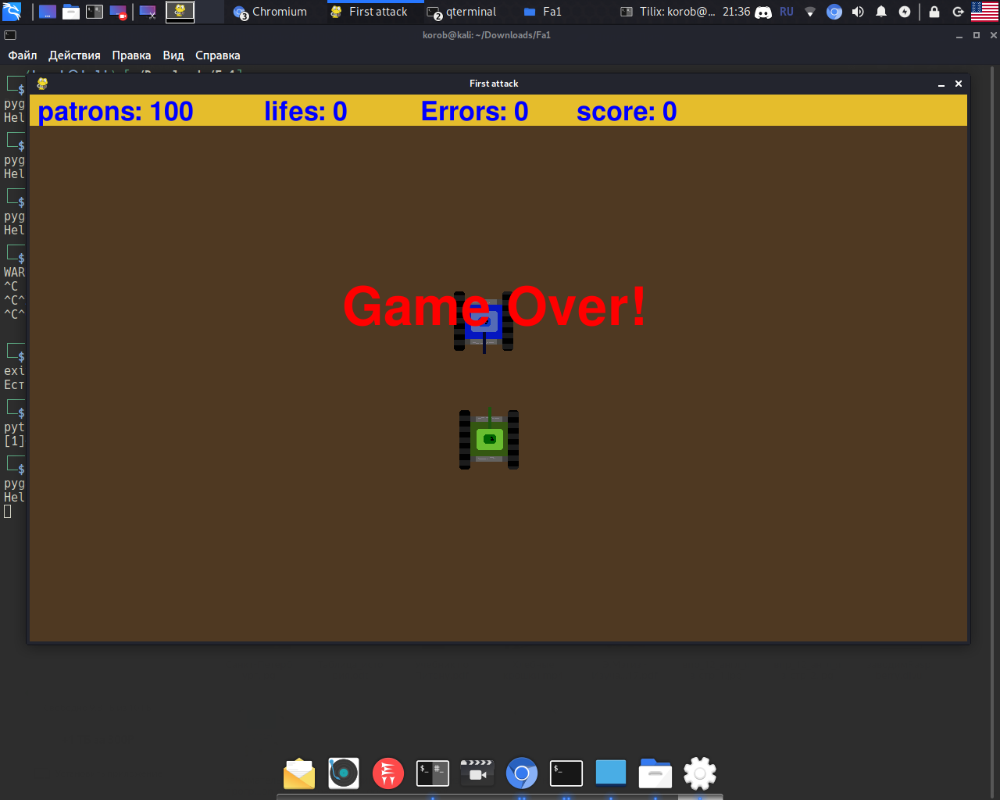

# tanks
This is my firs game written on python with pygame!

You need to have python >= 3.6 
<h1>Run this with:</h1>

1. <code>$ git clone https://github.com/KorobeinikovIgor/tanks</code>
2. <code>$ cd tanks</code>
3. <code>$ pip3 install -r requirements</code>
4. <code>$ python3 main.py </code>

​
​
